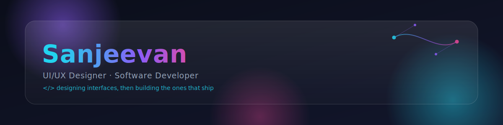

<!-- ============ BANNER ============ -->
<!-- Upload banner.svg to this repo (e.g. as assets/banner.svg) then point this src at it -->

<!-- ============ TYPING ANIMATION ============ -->

 

<!-- ============ SOCIAL / CONTACT BADGES — replace links ============ -->

 

## 🧩 About Me

- 🎨 I design interfaces first, then build the product that ships them
- 💻 Currently working across **UI/UX Design**, **Logo Design**, and **Full-stack Development**
- 🌱 Always refining my eye for typography, spacing, and motion
- ⚡ Fun fact: I probably have an opinion about your border-radius

 

## 🛠️ Tools & Stack

 

## 📊 GitHub Stats

 

## 🏆 LeetCode

 

## 🎧 Now Playing on Spotify

<!-- Requires deploying novatorem/spotify-github-profile to your own Vercel project — see notes below -->

 

## ⏱️ WakaTime Weekly Stats

<!-- The wakatime.yml GitHub Action rewrites everything between these two comments automatically. Don't delete the markers. -->

<!--START_SECTION:waka-->

<!--END_SECTION:waka-->

 

## 🐍 Contribution Snake

<!-- After the "Generate Snake Animation" workflow runs once, it publishes these files to the "output" branch -->

 

## 🧱 3D Contribution Graph

<!-- Generated by the contrib3d.yml workflow into /profile-3d-contrib -->

 

